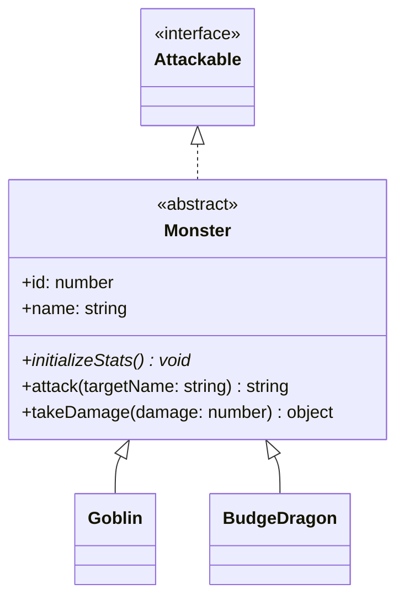

Aquí tienes una versión mejorada, organizada y visualmente atractiva de tu `README.md`. He utilizado iconos, tablas comparativas y bloques de código limpios para que parezca un proyecto profesional de nivel senior.

---

# 🏰 MU Online API — NestJS + TypeScript

> **Backend del proyecto MU Online.** Un reino construido bajo los principios de la Programación Orientada a Objetos (POO), Inyección de Dependencias y Arquitectura Limpia.

---

## 🚀 Inicio Rápido

### 1. Encender el Servidor
```bash
cd server/mu-online-api
npm install
npm run start:dev
```

### 🌱 2. Sembrado de Datos (Seeding)
Para que el mundo de MU cobre vida, necesitas poblar la base de datos en este orden exacto:

```bash
# 1. Crear Monstruos (Budge Dragon, Goblin, etc.)
curl -X POST http://localhost:3000/monsters/seed

# 2. Crear Mapas (Lorencia, Dungeon, Devias)
curl -X POST http://localhost:3000/maps/seed

# 3. Conectar Monstruos a Mapas (Relación Many-to-Many)
curl -X POST http://localhost:3000/maps/seed-monsters
```

### 🔍 3. Verificar en Base de Datos (PSQL)
```sql
-- Verificar que todo se guardó correctamente
psql -U postgres -d mu_online -c "SELECT * FROM monsters;"
psql -U postgres -d mu_online -c "SELECT * FROM maps;"
psql -U postgres -d mu_online -c "SELECT * FROM map_monsters;"
```

---

## 👥 Creación de Personajes (Postman/Insomnia)

Crea tus héroes iniciales enviando un `POST` a `http://localhost:3000/characters`:

| Personaje | Clase | JSON Payload |
| :--- | :--- | :--- |
| **Johan** | Dark Knight | `{ "name": "Johan", "characterClass": "DarkKnight" }` |
| **Merlin** | Dark Wizard | `{ "name": "Merlin", "characterClass": "DarkWizard" }` |
| **Arwen** | Fairy Elf | `{ "name": "Arwen", "characterClass": "Elf" }` |

---

## 📖 Swagger — El Storybook del Backend

Así como usamos **Storybook** para probar componentes visuales, usamos **Swagger** para probar la lógica de negocio.

> **Acceso:** [http://localhost:3000/api](http://localhost:3000/api)

| Característica | Storybook (Frontend) | Swagger (Backend) |
| :--- | :--- | :--- |
| **Dirección** | `localhost:6006` | `localhost:3000/api` |
| **Unidad** | Componentes React | Endpoints HTTP |
| **Entradas** | Props de TypeScript | Body / Query Params |
| **Propósito** | Pruebas visuales de UI | Pruebas de lógica real |

---

## 🧠 Mapa de Conceptos POO en la API

Cada acción en el juego dispara un concepto fundamental de objetos:

| Endpoint | Concepto POO | Implementación en Código |
| :--- | :--- | :--- |
| `POST /characters` | **Herencia + Abstracción** | `new DarkKnight()` llama a `super()` e inicializa stats únicos. |
| `GET /characters` | **Encapsulamiento** | Uso de `toJSON()` para ocultar IDs internos de la DB. |
| `POST /items` | **Interfaces** | `Weapon` extiende `Item` e implementa `Equippable`. |
| `POST /combat/start` | **Composición + DI** | Se crea una `CombatSession` inyectando el Service. |
| `POST /combat/attack` | **Polimorfismo** | `onLevelUp()` se comporta distinto según la clase del héroe. |

---

## 📐 Arquitectura del Sistema

<p align="center">

</p>

### El Ciclo de Vida de un Ataque ⚔️
Cuando presionas el botón **"Attack"** en el frontend, ocurre una cadena de eventos POO:

1.  **Inyección de Dependencias (DI):** NestJS entrega el `CombatService` ya instanciado al Controller.
2.  **Encapsulamiento:** El método `getCombat()` es `private`. Solo el servicio puede gestionar el estado de la sesión.
3.  **Composición:** La clase `CombatSession` no hereda de nadie; *tiene* un `Character` y un `Monster`.
4.  **Polimorfismo:** Al calcular el daño, el sistema llama a `character.calculateAttack()`. No le importa si es un mago o un guerrero, cada objeto sabe cómo calcular su propia fuerza.
5.  **Interfaces:** El monstruo contraataca usando el contrato `Attackable`, garantizando que cualquier enemigo pueda participar en el combate.

---

## 🏗️ La Regla de Oro: Atomic Design + API

En este proyecto mantenemos una separación estricta de responsabilidades:

```typescript
// 🔴 Átomos y Moléculas → DUMB
// No conocen el backend. Solo reciben props y pintan.

// 🟢 Organismos → SMART
// Aquí vive el fetch(), los useEffects y la conexión real a la API.
```

Esto permite que nuestra UI sea testeable en Storybook sin necesidad de tener el servidor de NestJS encendido.

---

> ✨ *Proyecto desarrollado para el aprendizaje de patrones avanzados en TypeScript y NestJS.*
---

## ¿Qué significa DUMB?

Un componente **DUMB** (también llamado "presentacional") solo hace una cosa:
**recibir props y renderizar**. No sabe de dónde vienen los datos,
no llama a ninguna API, no tiene `useEffect`, no maneja errores de red.

```tsx
// ✅ StatBar es DUMB — solo recibe props y pinta la barra
<StatBar label="HP" currentValue={390} maxValue={500} type="hp" />

// ✅ CharacterCard es DUMB — solo recibe props y pinta la card
<CharacterCard
  name="Johan"
  characterClass="DarkKnight"
  hp={{ current: 390, max: 500 }}
  // ...
/>
```

`CharacterCard` no sabe si Johan vino de PostgreSQL, de un JSON local,
o de los datos de una historia de Storybook. Solo sabe que recibió
`name="Johan"` y lo pinta.

---

## ¿Qué significa SMART?

Un componente **SMART** (también llamado "contenedor") sí conoce
el mundo exterior. Llama a la API, maneja los estados de carga
y error, y luego pasa los datos a los componentes DUMB.

```tsx
// ✅ CharacterList es SMART — llama al backend y distribuye los datos
function CharacterList() {

  const [characters, setCharacters] = useState([]);
  const [loading, setLoading]       = useState(true);
  const [error, setError]           = useState(null);

  // Aquí vive el fetch — en ningún átomo ni molécula
  useEffect(() => {
    fetch('http://localhost:3000/characters')
      .then(res => res.json())
      .then(data => setCharacters(data));
  }, []);

  // Pasa los datos a la molécula DUMB
  return characters.map(character => (
    <CharacterCard
      name={character.name}
      characterClass={character.class}
      // ...
    />
  ));
}
```

---

## ¿Por qué esta separación?

### 1. Storybook funciona sin backend

Como los átomos y moléculas son DUMB, puedes diseñarlos y verlos
en Storybook **sin que el backend esté corriendo**. Solo les pasas
props con datos de ejemplo y ya.

```
Storybook abierto    Backend apagado
      ↓                    ↓
CharacterCard ✅      CharacterList ❌ (no puede hacer fetch)
StatBar       ✅
LevelBadge    ✅
```

Si `CharacterCard` hiciera el fetch internamente, Storybook
mostraría un error en cada historia. Así no — Storybook
solo necesita props.

### 2. Reutilización real

Al ser DUMB, `CharacterCard` puede usarse en múltiples contextos
sin cambiar su código:

```
CharacterList    → datos reales de GET /characters
CombatScreen     → datos del personaje activo en combate
CreateCharacter  → preview antes de confirmar la creación
Storybook        → datos de ejemplo para diseñar
```

Si `CharacterCard` hiciera su propio fetch, estaría atada
a un solo endpoint y no podría reutilizarse así.

### 3. Errores fáciles de localizar

Con esta separación, cuando algo falla sabes exactamente dónde buscar:

```
Problema visual (color, tamaño, layout) → átomo o molécula
Problema de datos (fetch, loading, error) → organismo
```

---

## El mapa completo del proyecto

```
01-atoms/
├── StatBar            DUMB — pinta una barra, nada más
├── LevelBadge         DUMB — pinta el nivel, nada más
├── ClassLabel         DUMB — pinta la clase con su color
├── StatBox            DUMB — pinta un stat (STR/AGI/VIT/ENE)
├── SkillTag           DUMB — pinta el nombre de una habilidad
├── ActionBtn          DUMB — pinta un botón de acción
└── CharacterSilhouette DUMB — pinta el SVG del personaje

02-molecules/
├── CharacterCard      DUMB — combina los átomos en una card
└── StatGroup          DUMB — agrupa las tres barras (HP/MP/EXP)

03-organisms/          ← AQUÍ EMPIEZA LA CONEXIÓN AL BACKEND
├── CharacterList      SMART — GET /characters → renderiza CharacterCards
├── MapSelector        SMART — GET /maps → renderiza MapCards
└── CombatArena        SMART — POST /combat/start + POST /combat/:id/attack
```

---

## Analogía con MU Online

Piénsalo así — en el juego real de MU Online:

```
Átomo     = el píxel en pantalla. Solo sabe su color.
Molécula  = el sprite del personaje. Solo sabe cómo verse.
Organismo = el servidor del juego. Sabe quién eres,
            cuántos HP tienes, en qué mapa estás,
            y le dice al sprite cómo pintarse.
```

El servidor (organismo) tiene toda la lógica e información.
El sprite (molécula/átomo) solo recibe instrucciones y las ejecuta.

---

### Lo que ya dominarás al terminar este proyecto:

**POO completo:**
- ✅ Clases y encapsulamiento (`private` / `protected` / `public`)
- ✅ Herencia (`extends`, `super`, `override`)
- ✅ Clases abstractas (`abstract class`, `abstract methods`)
- ✅ Interfaces (`implements`, contracts)
- ✅ Polimorfismo (mismo método, comportamiento diferente)

**Patrones que Java también usa:**
- ✅ Repository pattern (TypeORM → Spring Data JPA)
- ✅ Dependency Injection (NestJS DI → Spring `@Autowired`)
- ✅ Decoradores/Anotaciones (`@Entity` → `@Entity`, `@Column` → `@Column`)
- ✅ Módulos (NestJS modules → Spring `@Component`, `@Service`)

**La transición TypeScript → Java será natural:**

| TypeScript / NestJS | Java / Spring Boot |
| :--- | :--- |
| `@Entity()` | `@Entity` |
| `@Column()` | `@Column` |
| `@Injectable()` | `@Service` |
| `@InjectRepository()` | `@Autowired` |
| `async/await` | `CompletableFuture` |
| `interface` | `interface` |
| `abstract class` | `abstract class` |

## 1. Instalación

```bash
# Instalar NestJS CLI globalmente
npm install -g @nestjs/cli

# Crear el proyecto
nest new mu-online-api

# Seleccionar: npm
cd mu-online-api
```

---

## 2. Estructura del proyecto

```
src/
├── characters/
│   ├── entities/
│   │   ├── character.entity.ts       ← Clase base abstracta (herencia)
│   │   ├── dark-knight.entity.ts     ← extiende Character
│   │   ├── dark-wizard.entity.ts     ← extiende Character
│   │   └── elf.entity.ts             ← extiende Character
│   ├── interfaces/
│   │   └── attackable.interface.ts   ← Contrato (polimorfismo)
│   ├── characters.controller.ts
│   ├── characters.service.ts         ← @Injectable()
│   └── characters.module.ts
├── monsters/
│   ├── entities/
│   │   ├── monster.entity.ts         ← Clase base abstracta + implements Attackable
│   │   ├── budge-dragon.entity.ts    ← extiende Monster
│   │   └── goblin.entity.ts          ← extiende Monster
│   ├── interfaces/
│   │   └── monster.interface.ts
│   ├── monsters.controller.ts
│   ├── monsters.service.ts           ← @Injectable()
│   └── monsters.module.ts
├── items/
│   ├── entities/
│   │   ├── item.entity.ts            ← Clase base items
│   │   ├── weapon.entity.ts          ← extiende Item
│   │   └── armor.entity.ts           ← extiende Item
│   ├── interfaces/
│   │   └── equippable.interface.ts   ← Contrato para items equipables
│   ├── items.controller.ts
│   ├── items.service.ts              ← @Injectable()
│   └── items.module.ts
├── maps/
│   ├── entities/
│   │   └── map.entity.ts
│   ├── maps.controller.ts
│   ├── maps.service.ts               ← @Injectable()
│   └── maps.module.ts
└── app.module.ts                     ← como INSTALLED_APPS en Django
```

---

## 3. Conceptos POO cubiertos

### Concepto 1 — Clases y Encapsulamiento
```
character.entity.ts
```
- `private` → solo accesible dentro de la clase
- `protected` → accesible en la clase Y en las clases hijas
- `public` → accesible desde cualquier lugar
- Getters para acceso controlado a propiedades privadas

---

### Concepto 2 — Herencia
```
character.entity.ts (padre abstracto)
      ↓ extends
dark-knight.entity.ts
dark-wizard.entity.ts
elf.entity.ts
```
- `extends` → DarkKnight ES UN Character
- `super()` → llama al constructor del padre
- `abstract` → obliga a las clases hijas a implementar el método
- `override` → redefine comportamiento del padre

---

### Concepto 3 — Interfaces y Polimorfismo
```
attackable.interface.ts   ← define el CONTRATO
      ↓ implements
monster.entity.ts         ← clase base que cumple el contrato
      ↓ extends
budge-dragon.entity.ts    ← implementación específica
goblin.entity.ts          ← implementación específica
```
- `interface` → define qué métodos DEBE tener una clase
- `implements` → la clase se compromete a cumplir el contrato
- `abstract` → define comportamiento común, delega lo específico
- **Polimorfismo**: mismo método `attack()`, comportamiento diferente en cada monstruo

```typescript
// El mismo método, comportamiento diferente — eso es polimorfismo
const monsters: Monster[] = [
  new BudgeDragon(),  // débil, zona inicial
  new Goblin(),       // rápido, poco daño
];
monsters.forEach(m => m.attack('Johan'));
```

---

### Concepto 4 — Inyección de Dependencias
```
characters.service.ts     ← @Injectable()
      ↓ inyectado en
characters.controller.ts  ← constructor(private service: CharactersService)
      ↓ registrado en
characters.module.ts      ← providers: [CharactersService]
```
- `@Injectable()` → esta clase puede ser inyectada en otras
- `@Controller()` → define la ruta base
- `@Module()` → agrupa Controller + Service (como una `app` de Django)

---

## 4. Comparación con Django

| NestJS | Django | Descripción |
|--------|--------|-------------|
| `@Module()` | `INSTALLED_APPS` | Registra la app |
| `@Controller()` | `urls.py` + `views.py` | Rutas y handlers |
| `@Injectable()` Service | `views.py` | Lógica de negocio |
| `@Entity()` TypeORM | `models.py` | Modelos de base de datos |
| `interface` | No existe nativo | Contrato de tipos |
| `abstract class` | No existe nativo | Clase base no instanciable |
| Guards | `IsAuthenticated` | Protección de rutas |

---

## 5. Endpoints disponibles

```
POST   /characters              ← Crear personaje
GET    /characters              ← Listar todos
GET    /characters/:name        ← Ver uno
POST   /characters/:name/exp    ← Ganar experiencia

GET    /monsters                ← Listar monstruos por mapa
GET    /maps                    ← Listar mapas disponibles
POST /combat/start
  → Busca personaje (CharactersService)
  → Busca mapa y obtiene monstruo aleatorio (MapsService)
  → Inicia el combate turno por turno

POST /combat/:id/attack
  → El personaje ataca al monstruo
  → El monstruo contraataca
  → Retorna el log del turno

POST /combat/:id/skill
  → El personaje usa una habilidad específica
  → Consume MP, calcula daño
  → El monstruo contraataca
```

---

## 🗺️ Mu Academy — Quest Log (reconstrucción en `mu-academy`)

Las Quests siguientes son la guía para reconstruir el proyecto en una carpeta nueva. El código del repositorio **mu-online** (este museo) solo recibe comentarios de arqueología; la implementación “mejorada” o distinta va en **mu-academy** cuando indique cada Quest.

---

### Quest 01 — «Los pergaminos de Lorencia» · Lección 1

**🧠 Lo que vas a descubrir:**

Vas a entender cómo el servidor “recuerda” a un Goblin y a un Budge Dragon en la **misma tabla** sin mezclar sus identidades: una columna discriminadora (`type`) + clases hijas que rellenan stats. Es la misma magia que en MU: un solo “sistema de mobs”, muchas criaturas distintas.

**🌍 Por qué esto existe en el proyecto:**

En el proyecto original, `mu-online-api/src/monsters/entities/monster.entity.ts` define la clase abstracta `Monster` con `@Entity('monsters')`, `@TableInheritance({ column: { type: 'varchar', name: 'type' } })`, columnas comunes (`name`, `level`, `health`, …) y `implements Attackable`. Los hijos `mu-online-api/src/monsters/entities/goblin.entity.ts` y `budge-dragon.entity.ts` usan `@ChildEntity('Goblin'|'BudgeDragon')` y `extends Monster` con `initializeStats()` distinto. Resuelve el problema de **no duplicar** tablas ni columnas para cada mob y de poder listar/consultar todos los enemigos con un solo repositorio TypeORM.

**🛠️ Scaffolding inicial:**

Backend (`mu-academy-api`):

```bash
# Crear el proyecto NestJS (elige npm cuando pregunte)
npx @nestjs/cli@latest new mu-academy-api
cd mu-academy-api

# TypeORM + driver PostgreSQL
npm install @nestjs/typeorm typeorm pg

# Variables de entorno: crea .env (no commitees secretos reales) con al menos:
# DB_HOST=localhost
# DB_PORT=5432
# DB_USERNAME=postgres
# DB_PASSWORD=tu_password
# DB_DATABASE=mu_academy
```

En `src/app.module.ts` importa `TypeOrmModule.forRoot({ type: 'postgres', host: process.env.DB_HOST, port: +process.env.DB_PORT, username: process.env.DB_USERNAME, password: process.env.DB_PASSWORD, database: process.env.DB_DATABASE, autoLoadEntities: true, synchronize: true })` (solo `synchronize: true` en desarrollo; en producción usa migraciones).

Crea PostgreSQL y la base `mu_academy`. Verifica que `npm run start:dev` arranca sin error de conexión.

Frontend (`mu-academy-ui`):

```bash
npm create vite@latest mu-academy-ui -- --template react-ts
cd mu-academy-ui
npm install

# Storybook (sigue el asistente; para React + Vite acepta defaults razonables)
npx storybook@latest init

npm run storybook
# Debe abrir http://localhost:6006
```

**⚔️ Pasos de construcción (en orden estricto):**

Paso 1 — Carpeta `monsters` y módulo Nest

- **QUÉ HACER:** `nest g module monsters` y `nest g service monsters` (controller opcional en Lección 1 si aún no expones API; si generas `nest g controller monsters`, déjalo mínimo). Registra `MonstersModule` en `AppModule`.
- **POR QUÉ:** Aísla todo lo de monstruos como en el original (`mu-online-api/src/monsters/monsters.module.ts`).
- **REFERENCIA:** `mu-online-api/src/monsters/monsters.module.ts`
- **CÓDIGO BASE:** `MonstersModule` importa `TypeOrmModule.forFeature([Monster, Goblin, BudgeDragon])` cuando las entidades existan.

Paso 2 — Contrato `Attackable` (o copia mínima para compilar Monster)

- **QUÉ HACER:** Crea `src/characters/interfaces/attackable.interface.ts` (o `src/common/interfaces` si prefieres, pero entonces ajusta imports) con los métodos que `Monster` necesite para `implements Attackable` en el original: revisa `mu-online-api/src/characters/interfaces/attackable.interface.ts` y replica la firma mínima.
- **POR QUÉ:** `Monster` del museo implementa ese contrato para que combate trate “atacantes” de forma uniforme.
- **REFERENCIA:** `mu-online-api/src/characters/interfaces/attackable.interface.ts`
- **CÓDIGO BASE:** `export interface Attackable { ... }` con los mismos métodos públicos que usa `Monster`.

Paso 3 — Entidad base `Monster` (tabla + herencia STI)

- **QUÉ HACER:** Archivo `src/monsters/entities/monster.entity.ts`: `export enum MonsterType { NORMAL, ELITE, BOSS }`, `@Entity('monsters')`, `@TableInheritance({ column: { type: 'varchar', name: 'type' } })`, `export abstract class Monster implements Attackable` con columnas equivalentes al original (`id`, `name`, `level`, `monsterType` enum, `map`, `health`, `maxHealth`, `attackMin`, `attackMax`, `defense`, `experienceReward`), constructor opcional como en el museo, `protected abstract initializeStats()`, métodos `attack`, `getAttackPower`, `takeDamage`, getters, `toJSON`.
- **POR QUÉ:** Es el núcleo de Lección 1: POO (abstracta + hijos) + TypeORM (una tabla, discriminador).
- **REFERENCIA:** `mu-online-api/src/monsters/entities/monster.entity.ts`
- **CÓDIGO BASE:** Esqueleto: clase abstracta + `@PrimaryGeneratedColumn()` + `@Column()` en campos + firmas de métodos; implementa cuerpos como en el museo línea por línea mientras aprendes.

Paso 4 — Hijos `Goblin` y `BudgeDragon`

- **QUÉ HACER:** `goblin.entity.ts` y `budge-dragon.entity.ts` con `@ChildEntity('Goblin')` / `@ChildEntity('BudgeDragon')`, `extends Monster`, `constructor` que llama `super(...)` con nombre/nivel/map/tipo, `initializeStats()` con números distintos (copia valores del museo para comparar).
- **POR QUÉ:** TypeORM escribe en columna `type` el string del ChildEntity y al leer instancia la subclase correcta.
- **REFERENCIA:** `mu-online-api/src/monsters/entities/goblin.entity.ts`, `budge-dragon.entity.ts`
- **CÓDIGO BASE:** `export class Goblin extends Monster { ... }` con `super('Goblin', 5, 'Lorencia', MonsterType.NORMAL)` (ajusta si tu mundo usa otros números).

Paso 5 — Registrar entidades en TypeORM

- **QUÉ HACER:** En `TypeOrmModule.forRoot`, usa `entities: [Monster, Goblin, BudgeDragon]` o `autoLoadEntities: true` con entidades registradas en `forFeature`. Arranca la app y comprueba en PostgreSQL que existe tabla `monsters` con columna `type` y filas al insertar desde código o seed posterior.
- **POR QUÉ:** Sin registrar entidades, Nest no mapea clases a tablas.
- **REFERENCIA:** `mu-online-api/src/app.module.ts` (patrón de entidades)
- **CÓDIGO BASE:** `TypeOrmModule.forFeature([Monster, Goblin, BudgeDragon])` dentro de `MonstersModule`.

Paso 6 — Primer componente React `MonsterCard` + Storybook

- **QUÉ HACER:** En `mu-academy-ui`, crea `src/components/MonsterCard/MonsterCard.tsx` que reciba props tipadas (`name`, `level`, `map`, `hp` como string o `{ current, max }`, `attackRange`, `defense`, `monsterKind: 'Goblin' | 'BudgeDragon'` o string). Sin fetch: componente **presentacional**. Añade `MonsterCard.stories.tsx` con al menos dos historias: “Goblin en Lorencia” y “Budge Dragon en Lorencia” con datos mock que imiten `toJSON()` del backend.
- **POR QUÉ:** Entrenas el vínculo mental “shape del JSON del servidor → props del UI” antes de conectar HTTP (Lección 2+).
- **REFERENCIA:** Nombres alineados con `toJSON()` en `mu-online-api/src/monsters/entities/monster.entity.ts`
- **CÓDIGO BASE:**

```tsx
export type MonsterCardProps = { name: string; level: number; map: string; hp: string; attack: string; defense: number; expReward: number };
export function MonsterCard(props: MonsterCardProps) { return (/* maquetación */); }
```

**📐 Diagramas a crear/actualizar en esta lección:**

En el README de **mu-academy** (no en este repo si no quieres mezclar), mantén diagramas acumulativos.

- **DIAGRAMA 1 — Clases e herencia (Mermaid classDiagram):** `Monster` abstracta, `implements Attackable`, `Goblin` y `BudgeDragon` con `extends`, método abstracto `initializeStats`, métodos concretos compartidos `attack`, `takeDamage`. Ejemplo de sintaxis:



- **DIAGRAMA 2 — Base de datos (Mermaid erDiagram):** Tabla `monsters` con columnas `id`, `type` (discriminador STI), `name`, `level`, `monsterType`, `map`, `health`, `maxHealth`, `attackMin`, `attackMax`, `defense`, `experienceReward`. Sin FKs extra en Lección 1 salvo que ya hayas añadido mapas (si no, omitir relaciones).

- **DIAGRAMA 3 — Módulos NestJS (Mermaid graph TD):** `AppModule` → `MonstersModule` → `TypeOrmModule` / `MonstersService` (y `MonstersController` si existe).

- **DIAGRAMA 4 — Componentes React (Mermaid graph TD):** `MonsterCard` ← `MonsterCard.stories` (mock props). Sin router aún si no lo necesitas.

**🚨 Trampas comunes del novato:**

- Confundir la columna **`type`** (discriminador STI: `Goblin`, `BudgeDragon`) con la propiedad **`monsterType`** (enum Normal/Elite/Boss): son dos conceptos distintos en el museo.
- Olvidar registrar **las tres** clases en TypeORM: solo `Monster` sin hijos provoca errores al persistir `@ChildEntity`.
- `synchronize: true` en producción: puede borrar datos; úsalo solo en dev en mu-academy.
- Storybook: componente con `fetch` interno rompe historias sin MSW; en Lección 1 mantén `MonsterCard` tonto (solo props).

**📋 Documentación obligatoria antes de cerrar la Quest:**

- [ ] Backend: si ya tienes endpoints, documenta con `@ApiOperation` y `@ApiResponse`; abre Swagger en `http://localhost:3000/api` (puerto por defecto Nest) y verifica. Si aún no hay controller en Lección 1, deja este ítem para cuando expongas `GET /monsters`.
- [ ] Frontend: `MonsterCard.stories.tsx` en Storybook; comprueba `http://localhost:6006`.
- [ ] README de mu-academy: diagramas 1–4 actualizados.

**✅ Criterio de "Misión Cumplida y Explicada":**

- [ ] Explicas `@TableInheritance` y señalas la línea equivalente en tu `monster.entity.ts` de mu-academy.
- [ ] Explicas qué pasa si borras `@ChildEntity` en un hijo o cambias el string `'Goblin'` sin actualizar datos.
- [ ] Das una analogía MU propia (no copiada del DM) entre STI y algo que veas en el juego (sprites, stats, spawns).
- [ ] Pegas o enlazas el diagrama Mermaid actualizado de tu README de mu-academy.

**🔍 Checkpoint de auto-verificación:**

Abre `mu-academy-api/src/monsters/entities/monster.entity.ts`. Debes ver `abstract class Monster`, `@TableInheritance` con columna `type`, y enum `MonsterType`. Compara con `mu-online-api/src/monsters/entities/monster.entity.ts` en este repositorio. En PostgreSQL, `\d monsters` debe listar columna `type` y las columnas de stats.

**🔍 Diferencias con mu-academy (notas del arqueólogo):**

- El README de inicio rápido más arriba menciona rutas como `cd server/mu-online-api`; en tu clon real la API puede vivir en `mu-online-api/`. En mu-academy usa **tus** rutas consistentes y documenta en tu propio README.
- Si en mu-academy colocas `Attackable` en otra carpeta que el museo, está bien siempre que imports y módulos reflejen **tu** estructura y el contrato sea equivalente.

---


